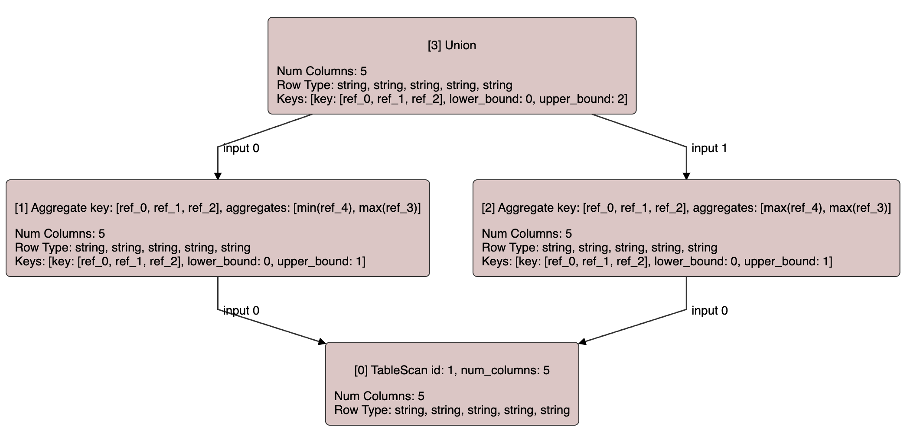
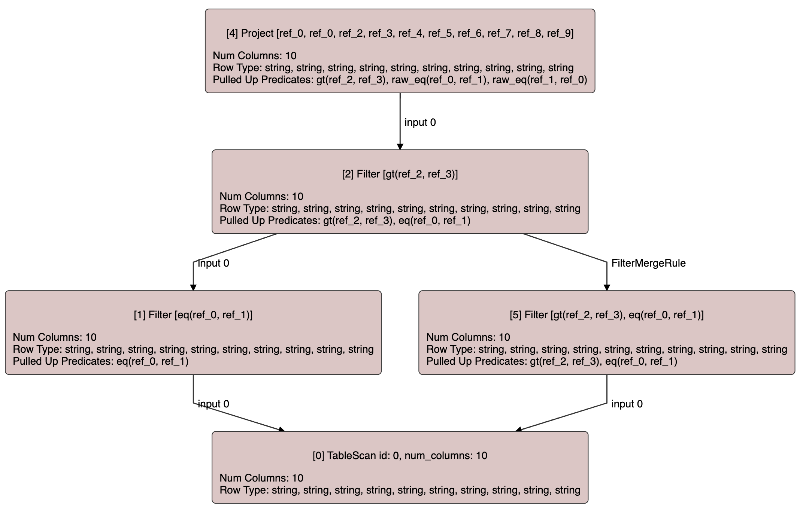

+++
title = 'A SQL query compiler from scratch in Rust (step by step): Part one, the query plan representation'
date = 2023-12-29T18:00:00+01:00
draft = false
+++

One of my favorite books is [Crafting Interpreters](https://craftinginterpreters.com/) by Robert Nystrom,
a very practical book that walks
you through the process of building an interpreted programming language. In the same spirit, I thought
it would be fun to write a series of blog spots as I go through the process of writing a new query
compiler from scratch once again. After having worked in several query compilers, and written a few
others for learning purposes (such as this one), I really believe in failing better every time and 
learning in the process. So let's fail better together this time!

Even though I've been a C++ dev for more than a decade, I have chosen Rust for this journey. I have
limited professional experience with Rust, but enough to appreciate how fun writing Rust is.

Writing a fully functional query compiler is a huge task. Something just too big for a pet project
like this. Also, since there is no query engine this is targeted for, I will just focus on the stuff
that is common to most query compilers: the SQL parser, the binder, the type system, the logical plan
and the logical query rewrites. This last part is where I plan to focus more, implementing some simple
query rewrites, such as predicate pushdown rewrites, and some more complex ones, such as predicate
propagation through join equalities, subquery decorrelation or removing redundant join operands.

The source code of this project can be found [here](https://github.com/asenac/rust-sql-playground).

## Scalar expression representation

Okay, but where do we start? The most common approach is to start with a parser that generates an AST
followed by some kind of binder, planner or converter, that validates the AST and converts it into
a logical or semantic plan representation. However, I will start with the logical plan representation
first and how to apply transformations to it, because to me that's where fun can be found.

In this logical plan representation we typically have logical operators that may contain scalar
expressions. Let's start with how scalar expressions are represented. For this I tend
to prefer a copy-on-write representation for two reasons: minimizing memory the footprint of the query,
but, more importantly, faster expression comparison as we can avoid descending some sub-expressions
if the two sub-expression being compared point to the same memory region.

Rust's `enum` feels like the perfect tool for the job, since we are going to need to a lot of pattern
matching of expressions, so let's use an `enum` for this:

```rust
enum ScalarExpr {
    Literal {
        value: String, // How to represent literal values deserves its own posts
    },
    InputRef {
        index: usize,
    },
    BinaryOp {
        op: BinaryOp,
        left: Rc<ScalarExpr>,
        right: Rc<ScalarExpr>,
    },
    NaryOp {
        op: NaryOp,
        operands: Vec<Rc<ScalarExpr>>,
    },
    ...
}

type ScalarExprRef = Rc<ScalarExpr>;
```

`Rc` is Rust's shared pointer so to speak, and it is key for our copy-on-write approach as we will see.

Of course, this is just the initial version and we may re-visit some things as we go along. For 
example, the distinction between binary operations and n-ary ones feels handy for pattern matching as
well, so let's move forward with this and re-visit later if needed.

It is needless to say that `BinaryOp` and `NaryOp` are also `enum`s.

Hopefully, in some later post we will add support for correlated column references and subqueries, but
let's jut omit that bit for now.

In this representation, all expressions within an operator are written in terms of the columns 
projected by their inputs, which are referenced by using `InputRef` expression type. This is what I
call an offset-based representation, as opposed to a variable-based representation, where some operators
define new variables that can be referenced by the operators upstream by their names or unique IDs.
There is a good [blog post](https://buttondown.email/jaffray/archive/representing-columns-in-query-optimizers/)
from Justin Jaffray comparing both approaches (if you are into query optimizers I strongly recommend
subscribing to his newsletter). If time permits, it would be a fun project to write a similar query
compiler using a variable-based representation and compare the two.

### Expression visitation

Once we have a representation for scalar expressions we can now write some utilities we are going to
need for transforming queries. Let's start with a simple utility: a function that given an expression
collects all the columns from the input operators referenced in the expression, ie. a utility that
traverses the given expression and collects all the distinct indices in all `InputRef`s sub-expressions.
The signature of this utility function is shown below:

```rust
fn collect_input_dependencies(expr: &ScalarExprRef) -> HashSet<usize>;
```

We could easily implement this as a recursive function but then the possibility of overflowing the stack
with a huge input query would always be there. Instead, I tend to prefer avoiding recursion as much as
possible anywhere in a query compiler.

Also, instead of replicating similar code in every utility for traversing an expression, let's implement
a generic expression visitation function. In order for to be as generic as possible, this function will
perform a pre-post-order visitation of the expression given and, for each sub-expression node, it will
invoke the corresponding callback functions of a new `ScalarExprPrePostVisitor` `trait`.

The implementor of this `trait` can decide whether a given sub-expression should be descended, pruned
from the visitation, or to abort the entire traversal, by returning the corresponding value from
`PreOrderVisitationResult`. The API exposed by this visitation utility is as follows:

```rust
pub enum PreOrderVisitationResult {
    VisitInputs,
    DoNotVisitInputs,
    Abort,
}

pub trait ScalarExprPrePostVisitor {
    fn visit_pre(&mut self, expr: &ScalarExprRef) -> PreOrderVisitationResult;
    fn visit_post(&mut self, expr: &ScalarExprRef);
}

pub fn visit_scalar_expr<V>(expr: &ScalarExprRef, visitor: &mut V)
where
    V: ScalarExprPrePostVisitor;
```

Now let's implement the visitation logic:


```rust
pub struct VisitationStep<V> {
    pub node: V,
    pub next_child: Option<usize>,
}

impl<V> VisitationStep<V> {
    pub fn new(node: V) -> Self {
        Self {
            node,
            next_child: None,
        }
    }
}

pub fn visit_scalar_expr<V>(expr: &ScalarExprRef, visitor: &mut V)
where
    V: ScalarExprPrePostVisitor,
{
    let mut stack = vec![VisitationStep::new(expr.clone())];
    while let Some(step) = stack.last_mut() {
        if step.next_child.is_none() {
            match visitor.visit_pre(&step.node) {
                PreOrderVisitationResult::Abort => break,
                PreOrderVisitationResult::VisitInputs => {}
                PreOrderVisitationResult::DoNotVisitInputs => {
                    visitor.visit_post(&step.node);
                    stack.pop();
                    continue;
                }
            }
            step.next_child = Some(0);
        }

        if step.next_child.unwrap() < step.node.num_inputs() {
            let input_idx = step.next_child.unwrap();
            step.next_child = Some(input_idx + 1);
            let input_expr = step.node.get_input(input_idx);
            stack.push(VisitationStep::new(input_expr));
            continue;
        }

        visitor.visit_post(&step.node);
        stack.pop();
    }
}

impl ScalarExpr {
    pub fn num_inputs(&self) -> usize {
        match self {
            ScalarExpr::Literal { .. } => 0,
            ScalarExpr::InputRef { .. } => 0,
            ScalarExpr::BinaryOp { .. } => 2,
            ScalarExpr::NaryOp { operands, .. } => operands.len(),
        }
    }

    pub fn get_input(&self, input_idx: usize) -> ScalarExprRef {
        assert!(input_idx < self.num_inputs());
        match self {
            ScalarExpr::BinaryOp { left, right, .. } => {
                if input_idx == 0 {
                    left.clone()
                } else {
                    right.clone()
                }
            }
            ScalarExpr::NaryOp { operands, .. } => operands[input_idx].clone(),
            ScalarExpr::Literal { .. } | ScalarExpr::InputRef { .. } => panic!(),
        }
    }
}
```

The code above uses a single stack for this pre-post order traversal of the expression tree. Each
level of the stack contains the node at that level and the next child of that node that will be
visited when returning to that level. Once all children of the node at the current level have been
visited `visit_post` for the current node that is then removed from the stack.

Also, as shown above we needed to implement a couple of functions for `ScalarExpr` to be able to
generically access the sub-expressions of a given expression: `num_inputs` and `get_input`.

Okay, now we have a generic expression traversal utility that requires implementing a trait... but
what if we are only interested in the pre-order part of the traversal? In fact, that's the most common
case, so let's write a `visit_scalar_expr_pre` utility on top of the one above that can just take
a closure as the visitation callback:

```rust
struct ScalarExprPreVisitor<'a, F>
where
    F: FnMut(&ScalarExprRef) -> PreOrderVisitationResult,
{
    visitor: &'a mut F,
}

impl<F> ScalarExprPrePostVisitor for ScalarExprPreVisitor<'_, F>
where
    F: FnMut(&ScalarExprRef) -> PreOrderVisitationResult,
{
    fn visit_pre(&mut self, expr: &ScalarExprRef) -> PreOrderVisitationResult {
        (self.visitor)(expr)
    }
    fn visit_post(&mut self, _: &ScalarExprRef) {}
}

pub fn visit_scalar_expr_pre<F>(expr: &ScalarExprRef, visitor: &mut F)
where
    F: FnMut(&ScalarExprRef) -> PreOrderVisitationResult,
{
    let mut pre_post_visitor = ScalarExprPreVisitor { visitor };
    visit_scalar_expr(expr, &mut pre_post_visitor);
}
```

Now we have all the utilities we need to implement our `collect_input_dependencies` function in a
non-recursive way:

```rust
pub fn collect_input_dependencies(expr: &ScalarExprRef) -> HashSet<usize> {
    let mut dependencies = HashSet::new();
    visit_scalar_expr_pre(expr, &mut |curr_expr: &ScalarExprRef| {
        if let ScalarExpr::InputRef { index } = **curr_expr {
            dependencies.insert(index);
        }
        PreOrderVisitationResult::VisitInputs
    });
    dependencies
}
```

We could make `visit_scalar_expr` and `visit_scalar_expr_pre` generic functions receiving a reference 
to any expression type implementing a generic trait providing these two functions. As we will see if I
ever get to explaining that part, we will use other intermediate representations for scalar expressions 
during the optimization process, so the more generic we make all the utilities around them the better.
This more generic version will look like this:

```rust
pub trait VisitableExpr {
    fn num_inputs(&self) -> usize;
    fn get_input(&self, input_idx: usize) -> Rc<Self>;
}

pub trait ExprPrePostVisitor<E: VisitableExpr> {
    fn visit_pre(&mut self, expr: &Rc<E>) -> PreOrderVisitationResult;
    fn visit_post(&mut self, expr: &Rc<E>);
}

pub fn visit_expr<E, V>(expr: &Rc<E>, visitor: &mut V)
where
    E: VisitableExpr,
    V: ExprPrePostVisitor<E>
{
    // .. same exact implementation as before
}
```

### Expression transformation

We can also use the visitation utilities in the previous section to rewrite expressions. Let's start
with a very simple rewrite but very useful at the same time.

In several query rewrites we will need to push an
expression, such as a filtering expression, down through a `Project` operator. A `Project` operator
contains a vector with the expressions it projects as its output columns, so to push an expression
on top of it through it we need to replace all `InputRef`s in the expression with the expression
projected by the `Project` operator at that position.

Consider the following example plan where there is a filter referencing the second column projected by
the input projection, which forwards the first column from its input and concatenates the second and
third columns from its input:

```
Filter ref_1 > 0
  Project [ref_0, ref_1 || ref_2]
    ...
```

For pushing down the filtering expression through the projection we just need to replace `ref_1` with
the expression in the projection at that position, ie. `ref_1 || ref_2`:

```
Project [ref_0, ref_1 || ref_2]
  Filter ref_1 || ref_2 > 0
    ...
```

Let's ignore non-deterministic projections for now (famous last words) for which the transformation
above is not allowed as it may alter the results of the query. 

I like to call this process as _dereferencing_ the expression. The signature of the function
implementing this rewrite is the following:

```rust
pub fn dereference_scalar_expr(expr: &ScalarExprRef, map: &Vec<ScalarExprRef>) -> ScalarExprRef;
```

In this copy-on-write representation for scalar expressions we tend to avoid cloning sub-expressions
that are not actually modified by the rewrite. For example, any literal in the input expression will
be re-used by the output expression in this rewrite.

Again, let's build some utilities that can be re-used for other expression rewrites as well. First of
all, we can add a function to clone an expression but replacing its inputs with the given ones:

```rust
impl ScalarExpr {
    pub fn clone_with_new_inputs(&self, inputs: &[ScalarExprRef]) -> ScalarExpr {
        assert!(inputs.len() == self.num_inputs());
        match self {
            ScalarExpr::BinaryOp { op, .. } => ScalarExpr::BinaryOp {
                op: op.clone(),
                left: inputs[0].clone(),
                right: inputs[1].clone(),
            },
            ScalarExpr::NaryOp { op, .. } => ScalarExpr::NaryOp {
                op: op.clone(),
                operands: inputs.to_vec(),
            },
            ScalarExpr::Literal { .. } | ScalarExpr::InputRef { .. } => panic!(),
        }
    }
}
```

And also, a utility function that given an expression reference and a list of possibly rewritten input
sub-expressions, it creates a new cloned expression using the function above if any input was rewritten.
Otherwise, it returns a reference to the original expression:

```rust
fn clone_expr_if_needed(mut expr: ScalarExprRef, new_inputs: &[ScalarExprRef]) -> ScalarExprRef {
    let num_inputs = new_inputs.len();
    assert!(num_inputs == expr.num_inputs());

    if num_inputs > 0 {
        if !(0..num_inputs)
            .map(|x| expr.get_input(x))
            .zip(new_inputs.iter())
            .all(|(original, new)| {
                &*original as *const ScalarExpr == &**new as *const ScalarExpr
            })
        {
            expr = expr.clone_with_new_inputs(new_inputs).to_ref();
        }
    }
    expr
}
```

Now we can implement a utility function that applies this type of _copy-on-write_ rewrites in post-order
using the utility method above, keeping the rewritten input sub-expressions for the current node as the
last elements of a stack. The following post-order visitor applies a given rewrite function to each
node and clones any sub-expression whose inputs have been rewritten:

```rust
struct ScalarExprRewriterPost<'a, F>
where
    F: FnMut(&ScalarExprRef) -> Option<ScalarExprRef>,
{
    stack: Vec<ScalarExprRef>,
    rewrite: &'a mut F,
}

impl<'a, F> ScalarExprRewriterPost<'a, F>
where
    F: FnMut(&ScalarExprRef) -> Option<ScalarExprRef>,
{
    fn new(rewrite: &'a mut F) -> Self {
        Self {
            stack: Vec::new(),
            rewrite,
        }
    }
}

impl<F> ScalarExprPrePostVisitor for ScalarExprRewriterPost<'_, F>
where
    F: FnMut(&ScalarExprRef) -> Option<ScalarExprRef>,
{
    fn visit_pre(&mut self, _: &ScalarExprRef) -> PreOrderVisitationResult {
        PreOrderVisitationResult::VisitInputs
    }

    fn visit_post(&mut self, expr: &ScalarExprRef) {
        let num_inputs = expr.num_inputs();
        let new_inputs = &self.stack[self.stack.len() - num_inputs..];
        let mut curr_expr = clone_expr_if_needed(expr.clone(), new_inputs);
        self.stack.truncate(self.stack.len() - num_inputs);
        if let Some(rewritten_expr) = (self.rewrite)(&curr_expr) {
            curr_expr = rewritten_expr;
        }
        self.stack.push(curr_expr);
    }
}
```

Again, let's write a function that can take a closure with the rewrite function:

```rust
pub fn rewrite_scalar_expr_post<F>(rewrite: &mut F, expr: &ScalarExprRef) -> ScalarExprRef
where
    F: FnMut(&ScalarExprRef) -> Option<ScalarExprRef>,
{
    let mut visitor = ScalarExprRewriterPost::new(rewrite);
    visit_scalar_expr(expr, &mut visitor);
    assert!(visitor.stack.len() == 1);
    visitor.stack.into_iter().next().unwrap()
}
```

Finally, our `dereference_scalar_expr` function could be implemented as follows:

```rust
pub fn dereference_scalar_expr(expr: &ScalarExprRef, map: &Vec<ScalarExprRef>) -> ScalarExprRef {
    rewrite_scalar_expr_post(
        &mut |expr: &ScalarExprRef| {
            if let ScalarExpr::InputRef { index } = expr.as_ref() {
                return Some(map[*index].clone());
            }
            None
        },
        expr,
    )
}
```

Another very common expression transformation is the opposite one, instead of pushing an expression
down through a projection, it lifts the expression through the projection. Given an expression written
in terms of the input of the projection, it will rewrite it in terms of the output of the projection,
if possible.

The following example illustrates the effect of this rewrite, where a filtering expression is lifted
up through a projection operator:

* Before:

```
Project [ref_0 + ref_1]
  Filter ref_0 + ref_1 > 0
    ...
```

* After:

```
Filter ref_0 > 0
  Project [ref_0 + ref_1]
    ...
```

However, the filter in the example below cannot be lifted through the projection since the projection
doesn't have a column exposing either the result of either `ref_0 + ref_1 > 0`, `ref_0 + ref_1` or 
both `ref_0` and `ref_1`. It does expose `ref_0` as its first column, but not `ref_1`.

```
Project [ref_0]
  Filter ref_0 + ref_1 > 0
    ...
```

Given the examples above, we know this rewrite must be applied in pre-order since we need to find
the longest sub-expression in the given expression projected by the projection operator. Also,
we know that this rewrite may fail if an `InputRef` expression not projected by the given projection
operator is reached.

The signature of this rewrite will be the following:

```rust
pub fn lift_scalar_expr(expr: &ScalarExprRef, proj: &Vec<ScalarExprRef>) -> Option<ScalarExprRef>;
```

where `None` is returned if the expression could not be lifted through the given vector of expressions.

We can easily write another utility visitor and a function to apply a rewrite closure in pre-order
while cloning sub-expression only if strictly needed in post-order. The code for this could be as
follows:

```rust
struct ScalarExprRewriterPre<'a, F>
where
    F: FnMut(&ScalarExprRef) -> Result<Option<ScalarExprRef>, ()>,
{
    stack: Vec<ScalarExprRef>,
    rewrite: &'a mut F,
    skip_post: bool,
}

impl<'a, F> ScalarExprRewriterPre<'a, F>
where
    F: FnMut(&ScalarExprRef) -> Result<Option<ScalarExprRef>, ()>,
{
    fn new(rewrite: &'a mut F) -> Self {
        Self {
            stack: Vec::new(),
            rewrite,
            skip_post: false,
        }
    }
}

impl<F> ScalarExprPrePostVisitor for ScalarExprRewriterPre<'_, F>
where
    F: FnMut(&ScalarExprRef) -> Result<Option<ScalarExprRef>, ()>,
{
    fn visit_pre(&mut self, expr: &ScalarExprRef) -> PreOrderVisitationResult {
        match (self.rewrite)(expr) {
            Ok(Some(rewritten_expr)) => {
                self.stack.push(rewritten_expr);
                self.skip_post = true;
                PreOrderVisitationResult::DoNotVisitInputs
            }
            Ok(None) => PreOrderVisitationResult::VisitInputs,
            Err(_) => {
                self.stack.clear();
                PreOrderVisitationResult::Abort
            }
        }
    }

    fn visit_post(&mut self, expr: &ScalarExprRef) {
        if self.skip_post {
            // `visit_pre` already left a rewritten expression in the stack
            self.skip_post = false;
            return;
        }
        // Clone the current node if needed
        let num_inputs = expr.num_inputs();
        let new_inputs = &self.stack[self.stack.len() - num_inputs..];
        let curr_expr = clone_expr_if_needed(expr.clone(), new_inputs);
        self.stack.truncate(self.stack.len() - num_inputs);
        self.stack.push(curr_expr);
    }
}
```

Finally, our rewrite utility for lifting expressions through a projection:

```rust
pub fn lift_scalar_expr(expr: &ScalarExprRef, proj: &Vec<ScalarExprRef>) -> Option<ScalarExprRef> {
    rewrite_scalar_expr_pre(
        &mut |expr: &ScalarExprRef| {
            if let Some(proj_col) = proj
                .iter()
                .enumerate()
                .find(|(_, proj_expr)| **proj_expr == *expr)
                .map(|(i, _)| i)
            {
                return Ok(Some(ScalarExpr::input_ref(proj_col).to_ref()));
            }
            if let ScalarExpr::InputRef { .. } = expr.as_ref() {
                Err(())
            } else {
                Ok(None)
            }
        },
        expr,
    )
}
```

`Ok(Some(...))` indicates the given sub-expression has been rewritten. `Ok(None)` indicates that the
given sub-expression was not rewritten but that their inputs should be descended. `Err(())` indicates
that the given sub-expression could not be rewritten and that the rewrite process must be aborted.

Another interesting and common expression rewrite that may also fail is re-mapping the indices of the
`InputRef`s sub-expressions in the given input expressions:

```rust
pub fn apply_column_map(
    expr: &ScalarExprRef,
    column_map: &HashMap<usize, usize>,
) -> Option<ScalarExprRef> {
    rewrite_scalar_expr_pre(
        &mut |expr: &ScalarExprRef| {
            if let ScalarExpr::InputRef { index } = expr.as_ref() {
                if let Some(mapped_index) = column_map.get(index) {
                    Ok(Some(ScalarExpr::input_ref(*mapped_index).to_ref()))
                } else {
                    Err(())
                }
            } else {
                Ok(None)
            }
        },
        expr,
    )
}
```

These new `rewrite_scalar_expr_post` and `rewrite_scalar_expr_pre` utilities will be used later for
all sort of expression rewrites we may need for optimizing our query plans.

Again, we could make them generic utilities that could be reused for any expression type implementing
`clone_with_new_inputs` function through the following trait:

```rust
pub trait RewritableExpr: Sized + VisitableExpr {
    fn clone_with_new_inputs(&self, inputs: &[Rc<Self>]) -> Rc<Self>;
}
```

## Equivalence classes

When dealing with expression in a query compiler, it is often useful to group expressions within
the same context (meaning expressions written in terms of the output of the same input operators)
that are known to always lead to the same values.

For instance, in the sub-plan below we know that `ref_0` and `'hello'` literal are equivalent
expressions, so we could replace `ref_0` in the output of the projection with `'hello'`.

```
Project [ref_0, ref1]
  Filter ref_0 = 'hello'
    ...
```

The resulting plan would look like this:

```
Project ['hello', ref_1]
  Filter ref_0 = 'hello'
    ...
```

For this type of optimizations we need to, given a list of predicates that are known to be true,
because they have been enforced earlier in the plan, group the expressions that are known to be
equivalent by using only the equality predicates. We use the following data structure for grouping
expressions that are known to be equivalent. We call these groups `equivalence` classes.

```rust
pub struct EquivalenceClass {
    /// Indicates that any of the equality predicates that lead to this class
    /// was using the null-rejecting equality operator, ie. the SQL equality
    /// operator (`BinaryOp::Eq`), and hence, none of the expressions within the
    /// class will evaluate to NULL.
    pub null_rejecting: bool,
    /// The list of expressions belonging to the class.
    pub members: BTreeSet<ScalarExprRef>,
}

pub type EquivalenceClasses = Vec<EquivalenceClass>;
```

`null_rejecting` indicates that one of the equality predicates that led to the creation of the
class is the SQL equality operator, which rejects NULL values, as opposed to `IS NOT DISTINCT FROM`
operator where two NULL values evaluate as equal.

The following two utility functions are used to work with equivalence classes. The first one
computes the equivalence classes given a list of predicates, while the second one returns
the equivalence class the given expression belongs to, if any.

```rust
pub fn extract_equivalence_classes(predicates: &Vec<ScalarExprRef>) -> EquivalenceClasses;

pub fn find_class(classes: &EquivalenceClasses, expr: &ScalarExprRef) -> Option<usize>;
```

At this point we have covered all the main concepts in the `scalar_expr` module in our project.
Now that we know how scalar expressions are represented and how to work them, let's dive into
the core of the plan representation: the Query Graph.

## The Query Graph

The _copy-on-write_ approach we have used for scalar expression works well for trees, but
unfortunately for us, queries are not trees but DAGs, for example for modeling common table
expressions, either explicit ones or discovered at optimization time.

Applying rewrite rules to a DAG needs some special care as we must never modify a shared
node, ie. a node reachable from more than one path from the root, using information that is
only valid from one of the paths reaching it.

Consider the following DAG with a diamond shape:

```
   U
  / \
 F   |
  \ /
   A
   |
   T 
```

If filter `F` only references columns corresponding to grouping key items from aggregate
`A` then we could transpose them. However, we cannot just change the input of `A` to
point to the filter, as that would lead to the following query graph where the filter
is applied in both branches of the top level union, even though in the original plan
it was only applied in one of them:

```
   U
  / \
  \ /
   A
   |
   F'
   |
   T 
```

Instead, we could create a clone of `A` and add the filter pushed down under it, which
would lead to the following valid plan, that is semantically equivalent to the initial
one:

```
   U
  / \
 A'  A
 |   |
 F'  |
  \ /
   T 
```

In this section we are going to try to design a DAG representation for query plans where
wrong result issues like the one above are hard to introduce.

Another issue we need to take into account in our design is how to make the borrow checker
happy. Working with graph data structures in Rust is not particularly easy because of the
borrow checker, specially if backpointers are needed (ie. for, given a node, easily knowing
what are the parent nodes it can be reached from). Using `RefCell` and `Rc` just moves
the problem to the execution time. For this, the simplest solution I've found is to move the
ownership of the nodes of the graph to the data structure representing the graph itself.

Finally, sometimes when applying transformations, as it will happen in our query rewriter,
we need to easily detect whether the query has settled in a fix point to which no more 
transformations can be applied. For this it is very helpful to have some kind of generation
number that keeps track of the number of mutations the query graph has suffered.

The snippet below shows the representation we have chosen for our query graph. As mentioned
earlier, all the nodes are owned by the query graph. They are uniquely identified and are
referenced through their IDs.

```rust
pub type NodeId = usize;

pub enum QueryNode {
    Project {
        outputs: Vec<ScalarExprRef>,
        input: NodeId,
    },
    Filter {
        conditions: Vec<ScalarExprRef>,
        input: NodeId,
    },
    TableScan {
        table_id: usize,
        num_columns: usize,
    },
    Join {
        conditions: Vec<ScalarExprRef>,
        left: NodeId,
        right: NodeId,
    },
    Aggregate {
        group_key: BTreeSet<usize>,
        input: NodeId,
    },
    ...
}

pub struct QueryGraph {
    nodes: HashMap<NodeId, QueryNode>,
    entry_node: NodeId,
    next_node_id: usize,
    parents: HashMap<NodeId, BTreeSet<NodeId>>,
    pub gen_number: usize,
}
```

Accessing a node given its ID can be done by using the following function:

```rust
impl QueryGraph {
    pub fn node(&self, node_id: NodeId) -> &QueryNode {
        self.nodes.get(&node_id).unwrap()
    }
}
```

Note that the function above will panic if an invalid `NodeId` is passed.

Nodes are instances of our `QueryNode` `enum`. Note that we will add more node types later
for modeling the remaining relation operations. Also, some of the operators are missing some
members that will be added later such as the join type or the aggregate expressions.

Each node type contains members for the
attributes of the node and the inputs of the node. By putting the inputs on each node type
we ensure each node type always has the correct number of inputs.

However, since each node may have an unlimited number of parent nodes we have chosen to track
these _backpointers_ in a map in the `QueryGraph` structure. That forces us to keep this map
up to date when adding and removing nodes. When adding a node we just need to register the
new node as the parent of its inputs:

```rust
impl QueryGraph {
    pub fn add_node(&mut self, node: QueryNode) -> NodeId {
        let node_id = self.next_node_id;
        for i in 0..node.num_inputs() {
            self.parents
                .entry(node.get_input(i))
                .or_insert_with(|| BTreeSet::new())
                .insert(node_id);
        }
        self.next_node_id += 1;
        self.nodes.insert(node_id, node);
        node_id
    }
}
```

In our model, nodes are only removed via replacements, ie. a node cannot be removed but replaced
with another node. Replacing a node means making all parents of the node being replaced point
to the given new node. In order to replace a node the following function must be used:

```rust
impl QueryGraph {
    pub fn replace_node(&mut self, node_id: NodeId, new_node_id: NodeId) {
        // All the parents of the old node are now parents of the new one
        if let Some(parents) = self.parents.remove(&node_id) {
            for parent_id in parents.iter() {
                let parent_node = self.nodes.get_mut(&parent_id).unwrap();
                for input in 0..parent_node.num_inputs() {
                    if parent_node.get_input(input) == node_id {
                        parent_node.set_input(input, new_node_id);
                    }
                }
            }

            if let Some(new_node_parents) = self.parents.get_mut(&new_node_id) {
                new_node_parents.extend(parents);
            } else {
                self.parents.insert(new_node_id, parents);
            }
        }
        // Replace the reference to the entry node as well
        if self.entry_node == node_id {
            self.entry_node = new_node_id;
        }

        self.remove_detached_nodes(node_id);
        self.gen_number += 1;
    }
}
```

As shown above, every time a node is replaced the generation number of the query graph is increased
keeping track of the number of modifications the query graph has gone through. This will be very
handy for determining whether a query graph has settled in a fix point when applying query rewrites.

`remove_detached_nodes` is our way of keeping the graph as clean as possible, by removing any node
under the node being replaced that is no longer reachable from the query graph. At the point where
`remove_detached_nodes` is called the node pointed by `node_id` is no longer attached to the query
graph as it doesn't have any parents leading to it, so it can be removed. If any of its inputs
ends up without any parent node after removing `node_id` node, then we could remove that input
node as well. We can keep repeating this process until we reach a leaf node or a node that has
another parent.

We will see later
that there are some transformations that need to look for common properties among all the parents
of a given node. Ensuring that all the parents of a node are actually attached to the query graph
is handy for the effectiveness of these transformation rules.

## Traversing the Query Graph

For traversing a query graph we can define the same utilities we had for expressions, but this time,
the reference to the current node being visited is represented by the query graph and the ID of the 
node.

```rust
pub trait QueryGraphPrePostVisitor {
    fn visit_pre(&mut self, query_graph: &QueryGraph, node_id: NodeId) -> PreOrderVisitationResult;
    fn visit_post(&mut self, query_graph: &QueryGraph, node_id: NodeId);
}

impl QueryGraph {
    pub fn visit<V>(&self, visitor: &mut V)
    where
        V: QueryGraphPrePostVisitor,
    {
        self.visit_subgraph(visitor, self.entry_node);
    }

    pub fn visit_pre<F>(&self, visitor: &mut F)
    where
        F: FnMut(&QueryGraph, NodeId) -> PreOrderVisitationResult,
    {
        let mut pre_post_visitor = QueryGraphPreVisitor { visitor };
        self.visit(&mut pre_post_visitor);
    }

    pub fn visit_subgraph<V>(&self, visitor: &mut V, node_id: NodeId)
    where
        V: QueryGraphPrePostVisitor,
    {
        let mut stack = vec![VisitationStep::new(node_id)];
        while let Some(step) = stack.last_mut() {
            if step.next_child.is_none() {
                match visitor.visit_pre(self, step.node) {
                    PreOrderVisitationResult::Abort => break,
                    PreOrderVisitationResult::VisitInputs => {}
                    PreOrderVisitationResult::DoNotVisitInputs => {
                        visitor.visit_post(self, step.node);
                        stack.pop();
                        continue;
                    }
                }
                step.next_child = Some(0);
            }

            let node = self.node(step.node);
            if step.next_child.unwrap() < node.num_inputs() {
                let input_idx = step.next_child.unwrap();
                step.next_child = Some(input_idx + 1);
                stack.push(VisitationStep::new(node.get_input(input_idx)));
                continue;
            }

            visitor.visit_post(self, step.node);
            stack.pop();
        }
    }
}
```

Again, we need implement two functions, `num_inputs` and `get_input` for `QueryNode` so that we can
traverse the query graph iteratively:

```rust
impl QueryNode {
    pub fn num_inputs(&self) -> usize {
        match self {
            Self::Project { .. } | Self::Filter { .. } | Self::Aggregate { .. } => 1,
            Self::TableScan { .. } => 0,
            Self::Join { .. } => 2,
        }
    }

    pub fn get_input(&self, input_idx: usize) -> NodeId {
        assert!(input_idx < self.num_inputs());

        match self {
            Self::Project { input, .. }
            | Self::Filter { input, .. }
            | Self::Aggregate { input, .. } => *input,
            Self::TableScan { .. } => panic!(),
            Self::Join { left, right, .. } => {
                if input_idx == 0 {
                    *left
                } else {
                    *right
                }
            }
        }
    }
}
```

Note that `visit_subgraph` visits shared nodes multiple times. The implementor of the visitor trait
is responsible for implementing the logic in `visit_pre` to avoid descending nodes more than once if
needed.

## Attaching computed properties to the Query Graph

There are a lot of properties that can be computed from a query graph that can be used for optimizing
it. For example, given an aggregate node whose grouping key is known to include a unique key of the
input relation/node of the aggregate, we can remove the aggregate node replacing it with a projection
with the constant-folded values of the aggregate expressions. Computing the unique keys of a given
node usually requires computing the unique keys of its input nodes, leading to some expensive recursive
computation, making this kind of optimizations very expensive unless we somehow avoid re-computing
these properties unless it is strictly needed by caching them in the query graph, as we have done.

To illustrate the caching mechanism for this properties in our design let's use the most basic derived
property I can think of: the number of columns projected by a given node, ie. its arity.
The following snipped shows the code we would need to execute every time we want to know the arity of
a given node:

```rust
impl QueryNode {
    pub fn num_columns(&self, query_graph: &QueryGraph) -> usize {
        match self {
            Self::Project { outputs, .. } => outputs.len(),
            Self::Filter { input, .. } => query_graph.node(*input).num_columns(query_graph),
            Self::TableScan { num_columns, .. } => *num_columns,
            Self::Join { left, right, .. } => {
                query_graph.node(*left).num_columns(query_graph)
                    + query_graph.node(*right).num_columns(query_graph)
            }
            Self::Aggregate { group_key, .. } => group_key.len(),
        }
    }
}
```

In the worst case, the recursion stack for computing the number of columns recursively is as deep as
the query graph. Less than ideal in a query compiler.

Instead, let's add a cache of computed properties that are evaluated lazily. For this, we can add a
new member to our `QueryGraph` structure:

```rust
pub struct QueryGraph {
    // ...
    pub property_cache: RefCell<PropertyCache>,
}

pub struct PropertyCache {
    /// Properties computed in a bottom-up manner.
    bottom_up_properties: HashMap<NodeId, HashMap<TypeId, Box<dyn Any>>>,
}
```

For each node, it may hold a set of properties identified by some `TypeId`. These properties must
be invalidated whenever there is a node replacement under a given node.

As shown below, there is a free function to access each property for a given node (`num_columns`
in this case). Internally, it uses a graph visitor to compute the property in a bottom-up manner,
which avoids descending a sub-graph if the value of the property is already known for the root
node of that sub-graph. `num_columns_unchecked` assumes the value of the property for the given
node is already in the cache, as it is guaranteed by the visitation logic.

`compute_num_columns_for_node` is the where the property is actually computed for a given node
assuming the value of the property is known for all its inputs. In fact, everything else is
boilerplate code that will be the same for all bottom-up properties. We will refactor that
later.

```rust
pub fn num_columns(query_graph: &QueryGraph, node_id: NodeId) -> usize {
    NumColumns::num_columns(query_graph, node_id)
}

struct NumColumns {}

impl NumColumns {
    fn num_columns(query_graph: &QueryGraph, node_id: NodeId) -> usize {
        let mut visitor = NumColumns {};
        query_graph.visit_subgraph(&mut visitor, node_id);
        visitor.num_columns_unchecked(query_graph, node_id)
    }

    fn num_columns_unchecked(&self, query_graph: &QueryGraph, node_id: NodeId) -> usize {
        query_graph
            .property_cache
            .borrow_mut()
            .node_bottom_up_properties(node_id)
            .get(&Self::metadata_type_id())
            .unwrap()
            .downcast_ref::<usize>()
            .unwrap()
            .clone()
    }

    fn metadata_type_id() -> TypeId {
        TypeId::of::<Self>()
    }

    fn compute_num_columns_for_node(&self, query_graph: &QueryGraph, node_id: NodeId) -> usize {
        match query_graph.node(node_id) {
            QueryNode::Project { outputs, .. } => outputs.len(),
            QueryNode::Filter { input, .. } => self.num_columns_unchecked(query_graph, *input),
            QueryNode::TableScan { num_columns, .. } => *num_columns,
            QueryNode::Join {
                left,
                right,
                ..
            } => {
                let left_columns = self.num_columns_unchecked(query_graph, *left);
                let right_columns = self.num_columns_unchecked(query_graph, *right);
                left_columns + right_columns
            }
            QueryNode::Aggregate {
                group_key,
                ..
            } => group_key.len(),
        }
    }
}

impl QueryGraphPrePostVisitor for NumColumns {
    fn visit_pre(&mut self, query_graph: &QueryGraph, node_id: NodeId) -> PreOrderVisitationResult {
        if query_graph
            .property_cache
            .borrow_mut()
            .node_bottom_up_properties(node_id)
            .contains_key(&Self::metadata_type_id())
        {
            PreOrderVisitationResult::DoNotVisitInputs
        } else {
            PreOrderVisitationResult::VisitInputs
        }
    }

    fn visit_post(&mut self, query_graph: &QueryGraph, node_id: NodeId) {
        if !query_graph
            .property_cache
            .borrow_mut()
            .node_bottom_up_properties(node_id)
            .contains_key(&Self::metadata_type_id())
        {
            let num_columns = self.compute_num_columns_for_node(query_graph, node_id);
            query_graph
                .property_cache
                .borrow_mut()
                .node_bottom_up_properties(node_id)
                .insert(Self::metadata_type_id(), Box::new(num_columns));
        }
    }
}
```

We could add some logic in `visit_pre` to avoid visiting the inputs of nodes whose arity can be known
from the node itself, for example for `Project` and `Aggregate`, but for now let's leave the boilerplate
code as generic as possible.

The same approach can be used for computing other bottom-up properties such as the unique keys or
keys with known bounds, the predicates/constraints that are known to be true at the output of a given
node and many more.

Since these properties are computed from the values of the property of its inputs, it must be invalidated
when there is any node replacement anywhere under a given node. The value of `num_columns` for a given
node must never change, but other properties like the ones mentioned above may change. In order to make
this mechanism as generic as possible so it works with all computed properties, we must always invalidate
the cached properties for a given node if there is a node replacement anywhere under it. That can be
achieved by adding some logic in the single function to perform node replacements: `QueryGraph::replace_node`.
As shown below, we traverse the plan upwards removing the cached properties for all the nodes upstream.

```rust
impl QueryGraph {
    pub fn replace_node(&mut self, node_id: NodeId, new_node_id: NodeId) {
        self.invalidate_properties_upwards(node_id);
        ...
    }

    fn invalidate_properties_upwards(&mut self, node_id: NodeId) {
        let mut stack = vec![node_id];
        while let Some(current_id) = stack.pop() {
            let prev_size = stack.len();
            if let Some(parents) = self.parents.get(&current_id) {
                stack.extend(parents.iter());
            }

            for idx in prev_size..stack.len() {
                self.invalidate_node_properties(stack[idx]);
            }
        }
    }

    fn invalidate_node_properties(&mut self, node_id: NodeId) {
        self.property_cache
            .borrow_mut()
            .invalidate_node_properties(node_id)
    }
}

impl PropertyCache {
    pub fn invalidate_node_properties(&mut self, node_id: NodeId) {
        self.bottom_up_properties.remove(&node_id);
    }
}
```

## Our first Rewrite Rule

In order to illustrate how to work with this representation, let's write the simplest possible
transformation rule: fusing two chained `Filter` operators into a single `Filter` operator, ie.
given a `Filter` operator whose input is another `Filter` operator replace the upper one with
a new `Filter` node containing the condition expressions from both.

First of all, let's define the interface for implementing this basic rewrite rules:

```rust
pub enum OptRuleType {
    Always,
    TopDown,
    BottomUp,
}

pub trait SingleReplacementRule {
    fn rule_type(&self) -> OptRuleType;

    fn apply(&self, query_graph: &mut QueryGraph, node_id: NodeId) -> Option<NodeId>;
}
```

As we will see later, we want to apply several rewrite rules while traversing the query graph,
mutating the shape of the graph. For each node visited, we want to try out a set of different
rewrite rules, that may result in the replacement of one or several nodes in the graph.
The `trait` above only covers rules that may result in the replacement of the current node
being visited. When talking about column pruning for joins while preserving the DAG shape of
the plan we will introduce a more generic `trait` for rules that may result in the replacement
of more than one node.

These rules can be applied either during the top-down part of the traversal of the graph, during
the bottom-up part or in both. That desire is indicated with the `rule_type` function.

```rust
pub struct FilterMergeRule {}

impl SingleReplacementRule for FilterMergeRule {
    fn rule_type(&self) -> OptRuleType {
        OptRuleType::TopDown
    }

    fn apply(&self, query_graph: &mut QueryGraph, node_id: NodeId) -> Option<NodeId> {
        if let QueryNode::Filter { conditions, input } = query_graph.node(node_id) {
            if let QueryNode::Filter {
                conditions: child_conditions,
                input: child_input,
            } = query_graph.node(*input)
            {
                return Some(
                    query_graph.add_node(QueryNode::Filter {
                        input: *child_input,
                        conditions: conditions
                            .clone()
                            .into_iter()
                            .chain(child_conditions.clone().into_iter())
                            .collect(),
                    }),
                );
            }
        }
        None
    }
}
```

In the following posts we will see how we can implement rules that replace several nodes
in the query graph at once, and also, how we can apply several rules in a single pre-post-order
traversal of the graph, using our visitation utility, until a fix point is reached.

## Visualizing the Query Graph

Throughout the posts in this series, we will use the following visual representation for reasoning
about query graphs, where each node represents a logical operator connected via directed arrows
to their input nodes.



Within each node, the first line contains the unique ID of the node and its type, together with
its internal properties. The remaining lines contain the computed properties for that node.

The effect of the rewrite rules can also be visualized with this representation by adding extra
arrows for the node replacements. For example, the following graph shows the replacement of node
2 with node 5 that combines the filter expressions in 1 and 2, using the `FilterMergeRule` described
earlier.



The graphs are generated from the JSON representation of the query graph and rendered using javascript.

## Our first predicate pushdown rule

In this model, predicate pushdown is implemented as a set of atomic transformations. For example,
one of these rules could transpose a `Filter` and a `Project` operator, using the `dereference_scalar_expr`
we saw earlier. Its implementation is as simple as this:

```rust
pub struct FilterProjectTransposeRule {}

impl SingleReplacementRule for FilterProjectTransposeRule {
    fn rule_type(&self) -> OptRuleType {
        OptRuleType::TopDown
    }

    fn apply(&self, query_graph: &mut QueryGraph, node_id: NodeId) -> Option<NodeId> {
        if let QueryNode::Filter { conditions, input } = query_graph.node(node_id) {
            if let QueryNode::Project {
                outputs,
                input: proj_input,
            } = query_graph.node(*input)
            {
                let new_conditions = conditions
                    .iter()
                    .map(|c| dereference_scalar_expr(c, outputs))
                    .collect::<Vec<_>>();
                let outputs = outputs.clone();
                let new_filter = query_graph.filter(*proj_input, new_conditions);
                return Some(query_graph.project(new_filter, outputs));
            }
        }
        None
    }
}
```

Again, we can visualize the effect of this transformation with the following example:


Note that this rule may unzip shared nodes, effectively converting the DAG into a tree.
For example, if `Project` 1 was a shared node (a node with multiple parents), this rule
would produce a new projection that is not connected with the original one. In a future
post we will see how to do predicate pushdown without unzipping the DAG shape of the
plan, for cases where maximizing sub-plan reuse is needed.

## Next steps

In this first post, we have shown how the query graph is represented, including its
representation for scalar expressions and computed properties. Also, we have implemented
two very basic rewrite rules.

In some post in the near future, we will introduce a few more rewrite rules together with
the rule application driver, that will combine a set of rules in the same traversal of the
graph until the query graph reaches a fix point where no further rewrites can be applied.
