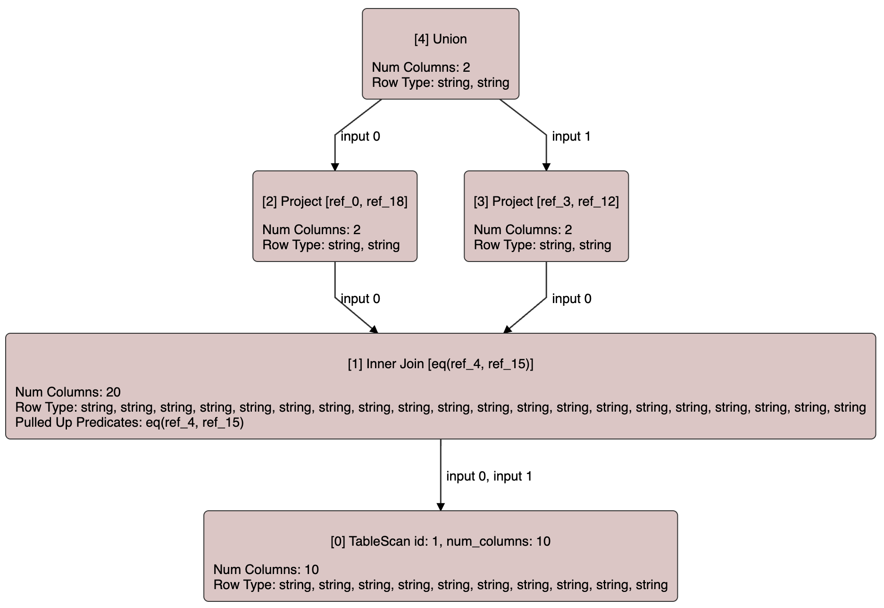
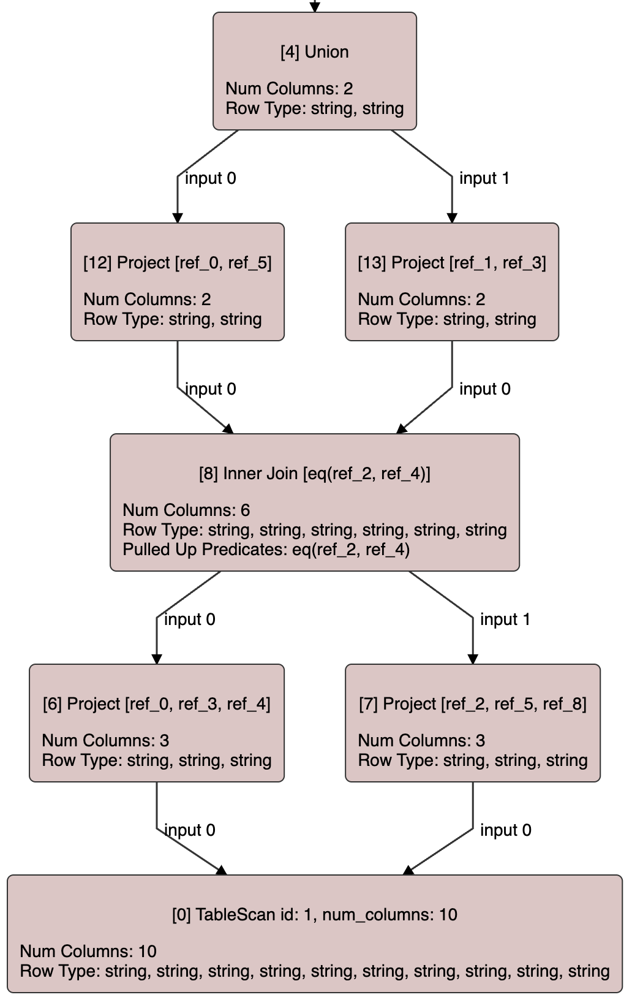

+++
title = 'A SQL query compiler from scratch in Rust (step by step): Part two, the query rewrite driver'
date = 2023-12-29T19:00:00+01:00
draft = false
+++

In the previous post of this series we introduced a couple of very basic rewrite rules.
In this one we are going to take a look at the rule application driver, responsible for
applying a set of rules while traversing the query graph until the query settles in a fix
point.

The rules we have seen so far implement a `SingleReplacementRule` trait with an `apply`
method that given a node may return a new node that must be used to replace the given
one in the query graph. The replacement
node must be semantically equivalent to the previous one and, hence, must provide the
same amount of columns as the previous one and these columns must have the same data types
as the old ones.

However, this simple interface doesn't work in all cases as illustrated in the following
section.

## Column pruning

Column pruning is the optimization that ultimately makes the table scan operators only
scan the columns of each table that are actually needed. In our offset-based representation 
this optimization works by pushing down _pruning_ projections. A _pruning_ projection is
a projection operator that doesn't forward all the columns from its input.

Consider the following example:



The join in node 1 projects 20 columns, 10 columns from each of its inputs. However, only 4 of them
are actually needed: columns 0 and 18 are used by its first parent and columns 3 and 12 are
used by it second parent. Also, the join itself uses columns 4 and 15 from its join condition.
Columns 0, 3 and 4 belong to its first input, while columns 12, 15 and 18 are the columns 2, 5
and 8 respectively from its second input.

Since we want to preserve the DAG-shape of the plan, we want to replace join 1 with one only
projecting the 6 columns that are actually needed. However, that involves replacing its parents
too since the columns referenced by them need to be remapped, since the new join will project
fewer columns. Ultimately, we want to end up with a plan like the one below:



Basically, we need to be able to write rules that may perform several nodes replacements at
the same time, as in the example above, where node 12 replaced node 2 and node 13 replaced
node 3. To achieve this, let's introduce a more generic `Rule` trait where the `apply`
function may return more than one node replacement:

```rust
pub trait Rule {
    fn rule_type(&self) -> OptRuleType;

    fn apply(&self, query_graph: &mut QueryGraph, node_id: NodeId)
        -> Option<Vec<(NodeId, NodeId)>>;
}
```

Each node replacement is presented by a pair of node IDs for the old and the new nodes.

`JoinPruningRule` can then be implemented using this interface so that given a join node,
whose parents are not using all the columns it projects, it replaces its parents with
new nodes referring to the columns of a the pruned version of the join. The code for this
rewrite rule can be seen [here](https://github.com/asenac/rust-sql-playground/blob/a82da60a428e037ecc1fefc9c2e73a5a59644e71/src/query_graph/optimizer/rules/join_pruning.rs).

Since `SingleReplacementRule` is just a special case for rules that only perform a single
node replacement, we can implement the more generic `Rule` trait for all `struct`s implementing
the `SingleReplacementRule` trait:

```rust
impl<T: SingleReplacementRule> Rule for T {
    fn rule_type(&self) -> OptRuleType {
        SingleReplacementRule::rule_type(self)
    }

    fn apply(
        &self,
        query_graph: &mut QueryGraph,
        node_id: NodeId,
    ) -> Option<Vec<(NodeId, NodeId)>> {
        self.apply(query_graph, node_id)
            .map(|replacement_node| vec![(node_id, replacement_node)])
    }
}
```

## The query rewrite driver

So far we have defined a `Rule` trait that all rewrite rules must implement. The
next step is to write the rule application driver to apply these rewrite rules while
traversing the query graph. In order to modify the query graph while traversing it,
we need a new visitation utility function that will take a new `QueryGraphPrePostVisitorMut`
trait:

```rust
pub enum PreOrderVisitationResult {
    VisitInputs,
    DoNotVisitInputs,
    Abort,
}

pub enum PostOrderVisitationResult {
    Continue,
    Abort,
}

pub trait QueryGraphPrePostVisitorMut {
    fn visit_pre(
        &mut self,
        query_graph: &mut QueryGraph,
        node_id: &mut NodeId,
    ) -> PreOrderVisitationResult;

    fn visit_post(
        &mut self,
        query_graph: &mut QueryGraph,
        node_id: &mut NodeId,
    ) -> PostOrderVisitationResult;
}
```

`QueryGraphPrePostVisitorMut` is very similar to its read-only version `QueryGraphPrePostVisitor`.
The main difference is that both the query graph and the ID of the current node are passed
via mutable reference.

Also, while applying rules we may need to abort the traversal. For that reason, we have made
`visit_post` able to return `Abort` to signal that.

A new `visit_mut` function, similar to the previously explained `visit_subgraph` one, using
a single stack for a pre-post order traversal has to be added to our `QueryGraph` `struct`:

```rust
impl QueryGraph {
    pub fn visit_mut<V>(&mut self, visitor: &mut V)
    where
        V: QueryGraphPrePostVisitorMut,
    {
        let mut stack = vec![VisitationStep::new(self.entry_node)];
        while let Some(step) = stack.last_mut() {
            if step.next_child.is_none() {
                match visitor.visit_pre(self, &mut step.node) {
                    PreOrderVisitationResult::Abort => break,
                    PreOrderVisitationResult::VisitInputs => {}
                    PreOrderVisitationResult::DoNotVisitInputs => {
                        let result = visitor.visit_post(self, &mut step.node);
                        stack.pop();
                        match result {
                            PostOrderVisitationResult::Abort => break,
                            PostOrderVisitationResult::Continue => continue,
                        }
                    }
                }
                step.next_child = Some(0);
            }

            let node = self.node(step.node);
            if step.next_child.unwrap() < node.num_inputs() {
                let input_idx = step.next_child.unwrap();
                step.next_child = Some(input_idx + 1);
                stack.push(VisitationStep::new(node.get_input(input_idx)));
                continue;
            }

            let result = visitor.visit_post(self, &mut step.node);
            stack.pop();
            match result {
                PostOrderVisitationResult::Abort => break,
                PostOrderVisitationResult::Continue => {}
            }
        }
    }
}
```

Now let's look at the rule application driver. We have called this component `Optimizer`
although something like `RewritePass` is perhaps more appropriate. An `Optimizer` is
basically a set of rules that are applied performing several traversal of the query
graph until a full traversal ends without performing any modification to the query graph.

Each rule indicates the part of the traversal it must be applied in. So, the first thing
we need to do is to group them:

```rust
pub struct Optimizer {
    rules: Vec<Box<dyn Rule>>,
    root_only_rules: Vec<usize>,
    top_down_rules: Vec<usize>,
    bottom_up_rules: Vec<usize>,
}

impl Optimizer {
    /// Builds an optimizer instance given a list of rules.
    pub fn new(rules: Vec<Box<dyn Rule>>) -> Self {
        let mut root_only_rules = Vec::new();
        let mut top_down_rules = Vec::new();
        let mut bottom_up_rules = Vec::new();
        for (id, rule) in rules.iter().enumerate() {
            match rule.rule_type() {
                OptRuleType::Always => {
                    top_down_rules.push(id);
                    bottom_up_rules.push(id);
                }
                OptRuleType::TopDown => top_down_rules.push(id),
                OptRuleType::BottomUp => bottom_up_rules.push(id),
                OptRuleType::RootOnly => root_only_rules.push(id),
            }
        }
        Self {
            rules,
            root_only_rules,
            top_down_rules,
            bottom_up_rules,
        }
    }
}
```

The only public method of an optimizer instance is the `optimize` method which takes a mutable
reference of the query graph. Let's ignore the `OptimizerContext` for now. As shown below,
it keeps looping until an iteration ends without performing any modification to the query
graph.

```rust
impl Optimizer {
    /// Optimize the given query graph by applying the rules in this optimizer instance.
    pub fn optimize(&self, context: &mut OptimizerContext, query_graph: &mut QueryGraph) {
        // TODO(asenac) add mechanism to detect infinite loops due to bugs
        loop {
            let last_gen_number = query_graph.gen_number;

            self.apply_root_only_rules(context, query_graph);

            let mut visitor = OptimizationVisitor {
                optimizer: self,
                context,
            };
            query_graph.visit_mut(&mut visitor);

            if last_gen_number == query_graph.gen_number {
                // Fix-point was reached. A full plan traversal without modifications.
                break;
            }
        }
    }
}
```

As the `TODO` comment indicates, it needs a mechanism to detect infinite loop bugs in
the optimizer where a query graph doesn't converge to a fix point. This mechanism
could be as simple as using a hard limit on the number of iterations allowed.

The traversal of the graph is performed using the `visit_mut` method we saw earlier.
`OptimizationVisitor` is the pre-post visitor that applies the corresponding set of rules
on each method: `TopDown` rules are applied in the pre-order part of the traversal, while
`BottomUp` rules are applied in the post-order part of the traversal. `Always` rules are
applied of both phases.

```rust
/// Helper visitor to apply the optimization rules in an optimizer instance during a mutating
/// pre-post order visitation.
struct OptimizationVisitor<'a, 'b, 'c> {
    optimizer: &'a Optimizer,
    context: &'b mut OptimizerContext<'c>,
}

impl QueryGraphPrePostVisitorMut for OptimizationVisitor<'_, '_, '_> {
    fn visit_pre(
        &mut self,
        query_graph: &mut QueryGraph,
        node_id: &mut NodeId,
    ) -> PreOrderVisitationResult {
        if self.optimizer.apply_rule_list(
            self.context,
            query_graph,
            &self.optimizer.top_down_rules,
            node_id,
        ) {
            PreOrderVisitationResult::VisitInputs
        } else {
            PreOrderVisitationResult::Abort
        }
    }

    fn visit_post(
        &mut self,
        query_graph: &mut QueryGraph,
        node_id: &mut NodeId,
    ) -> PostOrderVisitationResult {
        if self.optimizer.apply_rule_list(
            self.context,
            query_graph,
            &self.optimizer.bottom_up_rules,
            node_id,
        ) {
            PostOrderVisitationResult::Continue
        } else {
            PostOrderVisitationResult::Abort
        }
    }
}
```

Both methods return `Abort` if any node that is not the current node was replaced,
for example, some ancestor of the current node, which may mean that the current
subgraph being visited is no longer attached to the query graph. In such case,
we must abort the traversal and start over from the root node.

`apply_rule_list` below applies a given list of rules until a replacement replacing
a node that is not the current node being visited happens.

```rust
impl Optimizer {
    fn apply_rule_list(
        &self,
        context: &mut OptimizerContext,
        query_graph: &mut QueryGraph,
        rules: &Vec<usize>,
        node_id: &mut NodeId,
    ) -> bool {
        let mut can_continue = true;
        for rule in rules.iter().map(|id| self.rules.get(*id).unwrap()) {
            if let Some(replacements) = rule.apply(query_graph, *node_id) {
                for (original_node, replacement_node) in replacements {
                    // Replace the node in the graph and apply the remaining rules to the
                    // returned one.
                    query_graph.replace_node(original_node, replacement_node);

                    if original_node == *node_id {
                        // Make the visitation logic aware of the replacement, so the inputs of
                        // the new node are visited during the pre-order part of the visitation.
                        *node_id = replacement_node;
                    } else {
                        // We must restart the traversal before applying any other rule.
                        can_continue = false;
                    }
                }
                if !can_continue {
                    break;
                }
            }
        }
        can_continue
    }
}
```

This is the simple optimization framework we will use for now. Eventually we might need to
extend it to add exploration rules and a cost-based search through the space of alternative
plans, but that time hasn't come yet.

## A testing framework for the optimizer

For testing our rewrite rules, we use the [`datadriven`](https://crates.io/crates/datadriven)
library. Since we don't have a SQL parser yet, we need to register all our test queries
in a repository, so that they can be referenced by name from the test files. The snippet
below shows how one of these queries is constructed.

```rust
        queries.insert("filter_merge_1".to_string(), {
            let mut query_graph = QueryGraph::new();
            let table_scan_id = query_graph.table_scan(0, 10);
            let filter_1: ScalarExprRef = ScalarExpr::input_ref(0)
                .binary(BinaryOp::Eq, ScalarExpr::input_ref(1).into())
                .into();
            let filter_id_1 = query_graph.filter(table_scan_id, vec![filter_1.clone()]);
            let filter_2: ScalarExprRef = ScalarExpr::input_ref(2)
                .binary(BinaryOp::Gt, ScalarExpr::input_ref(3).into())
                .into();
            let filter_id_2 = query_graph.filter(filter_id_1, vec![filter_2.clone()]);
            query_graph.set_entry_node(filter_id_2);
            query_graph
        });
```

Then, in the test file we use the `run` command together with the name of the query we want
to optimize. The output of the test contains a text representation of the original query graph
followed by its optimized version. All the nodes are annotated with their computed properties.

After the optimized version we dump the query graph in JSON format after every optimization
applied to the graph. These JSON dumps can be used to render the graphs you have seen in this
post.

```
run
filter_merge_1
----
----
[2] Filter [gt(ref_2, ref_3)]
    - Num Columns: 10
    - Row Type: string, string, string, string, string, string, string, string, string, string
    - Pulled Up Predicates: gt(ref_2, ref_3), eq(ref_0, ref_1)
  [1] Filter [eq(ref_0, ref_1)]
      - Num Columns: 10
      - Row Type: string, string, string, string, string, string, string, string, string, string
      - Pulled Up Predicates: eq(ref_0, ref_1)
    [0] TableScan id: 0, num_columns: 10
        - Num Columns: 10
        - Row Type: string, string, string, string, string, string, string, string, string, string


Optimized:
[4] Project [ref_0, ref_0, ref_2, ref_3, ref_4, ref_5, ref_6, ref_7, ref_8, ref_9]
    - Num Columns: 10
    - Row Type: string, string, string, string, string, string, string, string, string, string
    - Pulled Up Predicates: gt(ref_2, ref_3), raw_eq(ref_0, ref_1), raw_eq(ref_1, ref_0)
  [5] Filter [gt(ref_2, ref_3), eq(ref_0, ref_1)]
      - Num Columns: 10
      - Row Type: string, string, string, string, string, string, string, string, string, string
      - Pulled Up Predicates: gt(ref_2, ref_3), eq(ref_0, ref_1)
    [0] TableScan id: 0, num_columns: 10
        - Num Columns: 10
        - Row Type: string, string, string, string, string, string, string, string, string, string

initial {"nodes":[{"id":"2","label":"[2] Filter [gt(ref_2, ref_3)]","annotations":["Num Columns: 10","Row Type: string, string, string, string, string, string, string, string, string, string","Pulled Up Predicates: gt(ref_2, ref_3), eq(ref_0, ref_1)"]},{"id":"1","label":"[1] Filter [eq(ref_0, ref_1)]","annotations":["Num Columns: 10","Row Type: string, string, string, string, string, string, string, string, string, string","Pulled Up Predicates: eq(ref_0, ref_1)"]},{"id":"0","label":"[0] TableScan id: 0, num_columns: 10","annotations":["Num Columns: 10","Row Type: string, string, string, string, string, string, string, string, string, string"]}],"edges":[{"from":"2","to":"1","label":"input 0"},{"from":"1","to":"0","label":"input 0"}]}
step TopProjectionRule {"nodes":[{"id":"2","label":"[2] Filter [gt(ref_2, ref_3)]","annotations":["Num Columns: 10","Row Type: string, string, string, string, string, string, string, string, string, string","Pulled Up Predicates: gt(ref_2, ref_3), eq(ref_0, ref_1)"]},{"id":"1","label":"[1] Filter [eq(ref_0, ref_1)]","annotations":["Num Columns: 10","Row Type: string, string, string, string, string, string, string, string, string, string","Pulled Up Predicates: eq(ref_0, ref_1)"]},{"id":"0","label":"[0] TableScan id: 0, num_columns: 10","annotations":["Num Columns: 10","Row Type: string, string, string, string, string, string, string, string, string, string"]},{"id":"3","label":"[3] Project [ref_0, ref_1, ref_2, ref_3, ref_4, ref_5, ref_6, ref_7, ref_8, ref_9]","annotations":["Num Columns: 10","Row Type: string, string, string, string, string, string, string, string, string, string","Pulled Up Predicates: gt(ref_2, ref_3), eq(ref_0, ref_1)"]}],"edges":[{"from":"2","to":"1","label":"input 0"},{"from":"1","to":"0","label":"input 0"},{"from":"3","to":"2","label":"input 0"},{"from":"2","to":"3","label":"TopProjectionRule"}]}
step ProjectNormalizationRule {"nodes":[{"id":"3","label":"[3] Project [ref_0, ref_1, ref_2, ref_3, ref_4, ref_5, ref_6, ref_7, ref_8, ref_9]","annotations":["Num Columns: 10","Row Type: string, string, string, string, string, string, string, string, string, string","Pulled Up Predicates: gt(ref_2, ref_3), eq(ref_0, ref_1)"]},{"id":"2","label":"[2] Filter [gt(ref_2, ref_3)]","annotations":["Num Columns: 10","Row Type: string, string, string, string, string, string, string, string, string, string","Pulled Up Predicates: gt(ref_2, ref_3), eq(ref_0, ref_1)"]},{"id":"1","label":"[1] Filter [eq(ref_0, ref_1)]","annotations":["Num Columns: 10","Row Type: string, string, string, string, string, string, string, string, string, string","Pulled Up Predicates: eq(ref_0, ref_1)"]},{"id":"0","label":"[0] TableScan id: 0, num_columns: 10","annotations":["Num Columns: 10","Row Type: string, string, string, string, string, string, string, string, string, string"]},{"id":"4","label":"[4] Project [ref_0, ref_0, ref_2, ref_3, ref_4, ref_5, ref_6, ref_7, ref_8, ref_9]","annotations":["Num Columns: 10","Row Type: string, string, string, string, string, string, string, string, string, string","Pulled Up Predicates: gt(ref_2, ref_3), raw_eq(ref_0, ref_1), raw_eq(ref_1, ref_0)"]}],"edges":[{"from":"3","to":"2","label":"input 0"},{"from":"2","to":"1","label":"input 0"},{"from":"1","to":"0","label":"input 0"},{"from":"4","to":"2","label":"input 0"},{"from":"3","to":"4","label":"ProjectNormalizationRule"}]}
step FilterMergeRule {"nodes":[{"id":"4","label":"[4] Project [ref_0, ref_0, ref_2, ref_3, ref_4, ref_5, ref_6, ref_7, ref_8, ref_9]","annotations":["Num Columns: 10","Row Type: string, string, string, string, string, string, string, string, string, string","Pulled Up Predicates: gt(ref_2, ref_3), raw_eq(ref_0, ref_1), raw_eq(ref_1, ref_0)"]},{"id":"2","label":"[2] Filter [gt(ref_2, ref_3)]","annotations":["Num Columns: 10","Row Type: string, string, string, string, string, string, string, string, string, string","Pulled Up Predicates: gt(ref_2, ref_3), eq(ref_0, ref_1)"]},{"id":"1","label":"[1] Filter [eq(ref_0, ref_1)]","annotations":["Num Columns: 10","Row Type: string, string, string, string, string, string, string, string, string, string","Pulled Up Predicates: eq(ref_0, ref_1)"]},{"id":"0","label":"[0] TableScan id: 0, num_columns: 10","annotations":["Num Columns: 10","Row Type: string, string, string, string, string, string, string, string, string, string"]},{"id":"5","label":"[5] Filter [gt(ref_2, ref_3), eq(ref_0, ref_1)]","annotations":["Num Columns: 10","Row Type: string, string, string, string, string, string, string, string, string, string","Pulled Up Predicates: gt(ref_2, ref_3), eq(ref_0, ref_1)"]}],"edges":[{"from":"4","to":"2","label":"input 0"},{"from":"2","to":"1","label":"input 0"},{"from":"1","to":"0","label":"input 0"},{"from":"5","to":"0","label":"input 0"},{"from":"2","to":"5","label":"FilterMergeRule"}]}
final {"nodes":[{"id":"4","label":"[4] Project [ref_0, ref_0, ref_2, ref_3, ref_4, ref_5, ref_6, ref_7, ref_8, ref_9]","annotations":["Num Columns: 10","Row Type: string, string, string, string, string, string, string, string, string, string","Pulled Up Predicates: gt(ref_2, ref_3), raw_eq(ref_0, ref_1), raw_eq(ref_1, ref_0)"]},{"id":"5","label":"[5] Filter [gt(ref_2, ref_3), eq(ref_0, ref_1)]","annotations":["Num Columns: 10","Row Type: string, string, string, string, string, string, string, string, string, string","Pulled Up Predicates: gt(ref_2, ref_3), eq(ref_0, ref_1)"]},{"id":"0","label":"[0] TableScan id: 0, num_columns: 10","annotations":["Num Columns: 10","Row Type: string, string, string, string, string, string, string, string, string, string"]}],"edges":[{"from":"4","to":"5","label":"input 0"},{"from":"5","to":"0","label":"input 0"}]}
----
----

```

The `run` command accepts an optional list of rules. If that list is specified, the test won't
use the default `Optimizer` instance, but one created only with the specified rules. This can
be used to test specific rules, with an specific plan shape at its input, as it happens in the
following test:

```
run rules=(FilterMergeRule)
filter_merge_2
----
----
[3] Filter [lt(ref_4, ref_5)]
    - Num Columns: 10
    - Row Type: string, string, string, string, string, string, string, string, string, string
    - Pulled Up Predicates: gt(ref_2, ref_3), eq(ref_0, ref_1), lt(ref_4, ref_5)
...
```

Eventually, once we have a SQL parser, we will use SQL as the input for our tests. Also, new
commands will be added for adding tables to our test catalog.
